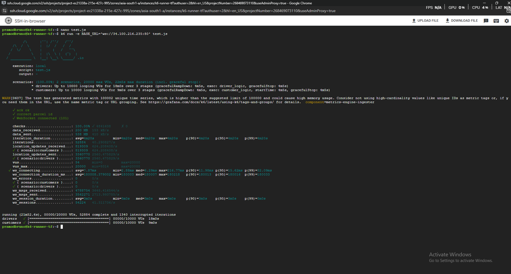
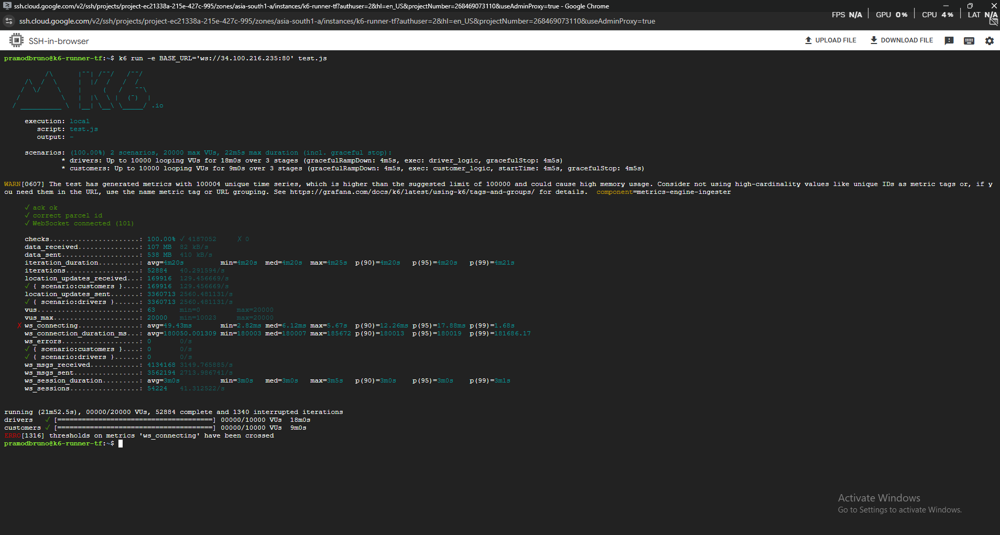
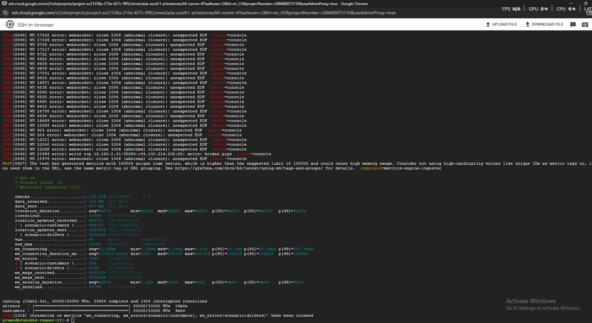

 ## Resilience Case Study: Chaos Engineering at 20k VUs 

 It’s not enough to build for the best case.So, I architected and tested for the worst

 
 For me to validate the fault tolerance of the GKE cluster, I performed a total of three
 tests on the same scripts .As I 
 wanted to to quantify the "Blast Radius" of a backend crash and measure the recovery 
 speed of the Kubernetes control plane.

 - **Normal test with 20,000 VU**
 - **Normal test with 20,000 VU forced eviction of redis node in the cluster**
 - **Normal test with 20,000 VU forced eviction of main backend axum-api in the cluster**

 # Normal Test with 20,000 VU

 

 In this test for a total iterations of 52884 in k6 with messages sent  by driver in
average are 2560.47 messages per seconds and customer received 624 messages per second.
With k6 metrics **p(95)=15.62ms**, **p(99)=32.09ms** and **ws_errors=0**

# Normal Test with 20,000 VU forced eviction of redis node in the cluster

In this test a Redis node was forcefully deleted by me at the peak load of 20k VUs using 
the command "kubectl delete redis-cluster-1 -n parcel-app --grace-period=0 --force" 
for a total iterations of 52884 in k6 with messages sent  by driver in average are 
2560.47 messages per seconds and customer received 130 messages per second.
With k6 metrics **p(95)=17.88ms**, **p(99)=1.68s** and **ws_errors=0**

*Observations*

In this k6 metrics, we can observe our coonection spike in p99 was above 1.68s during 
the 4-second failover window. This data proved that while the Redis Slave  successfully 
take Master place which resulted in zero errors.

*Fault and Failure*

I configured only 3 nodes making it heavily rely on more on each redis node and sustain 
20k VUs. However, the Chaos Test revealed that these long-lived connections
created a 'stale endpoint' problem during pod eviction.

*Result*

Despite losing a Primary Redis node, the Rust backend's connection pooling and retry 
logic handled the failover transparently. Users saw a latency spike, but zero data 
loss occurred—proving the system's high consistency

*Optimization* 
I would implement a Redis Sentinel or Cluster-aware connection pool with a shorter 
'heartbeat' interval to detect master-failover in milliseconds rather than seconds.

# Normal test with 20,000 VU forced eviction of main backend axum-api in the cluster

In this test a backend api was forcefully deleted by me at the peak load of 20k VUs using 
the command "kubectl delete axum-api-5d96b96c56*j6rdh -n parcel-app --grace-period=0 --force" 
for a total iterations of 53484 in k6 with messages sent  by driver in average are 
2551.78 messages per seconds and customer received 376 messages per second.
With k6 metrics **p(95)=28.86ms**, **p(99)=547.36ms** and **ws_errors=1895**

*Observations*

In this k6 metrics, we can observe our coonection spike in p99 was above 547.36ms but 
with error rate of 3.5% during the 4-second failover window. This data proved that while 
the Ingress-Nginx controller successfully re-routed traffic, there was a momentary TCP 
handshake backlog which resulted in 3.5% errors rate.

*Fault and Failure*

I configured aggressive upstream keep-alives (3600s) to minimize TLS handshake overhead 
and sustain 20k VUs. However, the Chaos Test revealed that these long-lived connections
created a 'stale endpoint' problem during pod eviction.

*Result*

NGINX attempted to reuse idle sockets tied to the deleted pod, contributing to the 
1,895 errors and the 547ms p99 spike.

*Optimization* 
To balance both, I would implement a tighter proxy-next-upstream 
policy to ensure that if a keep-alive connection fails, NGINX immediately retries a 
different pod without counting it as a failed request to the client.
