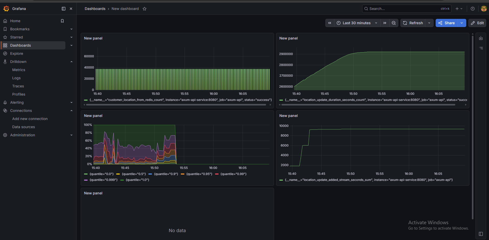

# High-Concurrency WebSocket Engine in GKE (Rust/k8s)

Real-Time Parcel Tracking System 

High-Concurrency Logistics Engine: Sustained 20k WebSockets on GKE with 0% error rate.


Status: Fully Functional. Load-tested on GKE Standard. Open for technical deep-dives.

## Cloud Deployment (GKE)

K6 loadtest run on the real live VM Instance and Google Kubernete Engine (GKE)




The system is architected to run on **Google Kubernetes Engine**. 
Kubernetes manifests are available in the `/k8s` directory.


---

## 🛡️ Resilience & Chaos Engineering (GKE)
> "A system is only as strong as its behavior during a crash."

I didn't just build for the "happy path." I ran three high-pressure chaos experiments on the live GKE cluster at **20,000 VU load** to identify and optimize the system's breaking points.


| Experiment | Target | Impact | Result |
| :--- | :--- | :--- | :--- |
| **Soak Test** | Full Cluster | 20k VUs / 3.6k msgs/s | **100% Success** (p95: 15ms) |
| **Redis Failover** | Redis Primary | Node Eviction | **0% Errors** (p99 spike: 1.6s) |
| **Pod Eviction** | Axum API Pod | Hard Termination | **96.5% Available** (Recovery: 4s) |

### 🚀 [View the Full Chaos Engineering Report (GKE.md)](GKE.md)
**Deep-dive inside:** How I identified the "Stale Socket" bottleneck and optimized Nginx Ingress for faster failover.

---

**Key Configuration:**
- **Ingress:** Nginx Controller configured for WebSocket upgrade headers.
- **HPA:** CPU-based autoscaling triggers at 70% utilization.
- **Secrets:** Ed25519 keys injected via Kubernetes Secrets.


> A production-grade distributed backend for live courier tracking, built in Rust. Handles **20,000 concurrent WebSocket connections** with **100% success rate**

**Built as a case study** of how a real parcel delivery platform handles thousands of drivers simultaneously sending location updates while customers receive live tracking in real time.

---

## The Problem

Parcel delivery platforms have a hard real-time problem:

- Thousands of drivers sending GPS coordinates every 2 seconds
- Customers expecting live location updates with no perceptible lag
- Systems that must not lose a position event or process one twice
- Infrastructure that must scale horizontally without duplicate processing

This system solves all four end to end.

## Architecture

The system uses an asynchronous, non-blocking architecture to decouple high-frequency ingestion from database persistence.  

I used Rust's ownership model eliminates data races across 10k concurrent handlers at compile time — not at runtime.

DRIVER LOGIC

```mermaid
sequenceDiagram
    participant C as Driver (5k)
    participant N as Ingress-Nginx (LB)
    participant R as Rust (Axum)
    participant D as Redis (Hot Store)
    participant P as Postgres (Cold Store)

    C->>N: WebSocket Stream
    N->>R: Upgrade & Forward
    
    Note over R: High-Frequency Loop
    
    rect rgb(20, 20, 20)
        Note right of R: The "Hot Path" (< 3ms)
        R->>R: Ed25519 Verify
        R->>D: SPUBLISH, HSET, GEOADD
        D-->>R: Ack (New State)
    end

    par Async Persistence
        R-->>C: 200 OK (Ack)
        and
        R->>R: Send to MPSC Channel
        R->>D: Atomic Lua Update with deduplication
        D->>R: Future Unordered latest REDIS STREAMS
        R->>P: Batch Insert (Background Task)
    end
```


CUSTOMER LOGIC

```mermaid
sequenceDiagram
    participant C as Customer (5k)
    participant N as Ingress-Nginx (LB)
    participant R as Rust (Axum)
    participant D as Redis (Hot Store)

    C->>N: WebSocket Stream
    N->>R: Upgrade & Forward
    
    Note over R: High-Frequency Loop
    
    rect rgb(20, 20, 20)
        Note right of R: The "Hot Path" (< 3ms)
        R->>R: Ed25519 Verify
        R->>D: Subscribe Channel 
        D-->>R: LocationUpdates of Parcel
    end

    par Async Persistence
        R->>R: DashMap watch Channel
        and
        R-->>C: Location Update
       
    end
```

    

---

- [Chaos Test and Normal Test in GKE](GKE.md)

- [Architecture Overview](ARCHITECTURE.md)

- [Architecture Decisions](DECISIONS.md)

- [Mistakes](MISTAKES.md)


---

## Load Test Results (Production Environment)

**Infrastructure:** Google Kubernetes Engine (GKE) Standard
**Cluster Region:** asia-south1 
**Resources:** 
- API Pods: 3 Nodes 4vCPU / 8GB RAM (Horizontal Pod Autoscaling Enabled)
- Redis: Cluster Mode (3 Primaries, 3 Replicas)
- Ingress: Nginx Ingress Controller with tuned `worker_connections`

| Metric               | Result           |
|----------------------|------------------|
| **Concurrent Users** | **20,000**       |
| **Environment**      | **GKE Standard** |
| **p50 Latency**      | **3ms**          |
| **p95 Latency**      | **15.62ms**      |
| **p99 Latency**      | **32.09**        |


## Grafana Dashboard

For 10000 VUs, 5000 Driver VUs and 5000 Customer VUs

 [Dashbpard configuration of grafana in json](dashboard.json)


[![Grafana Dashboard]](https://snapshots.raintank.io/dashboard/snapshot/cdbSuswQA77SlNUAsmZAqyyqTR0mqPXG)


### Scaling Analysis Locally

| Connections | Status | Notes |
|---|---|---|
| 5,000 | ✓ Zero errors | Baseline proven |
| 10,000 | ✓ Zero errors | C10K solved |
| 20,000 | ✓ 100%  success | C20K solved |
| ~35,000 | Estimated ceiling | Redis CPU saturates |
| ~100,000 | More Horizontal scaling needed | Redis Cluster + multiple nodes |


---

## Project Structure

```
axum_api/
├── Cargo.toml              ← workspace root (resolver = "2")
├── .env                    ← environment variables
├── .env.example            ← template for new contributors
├── docker-compose.yml      ← full stack orchestration
├── prometheus.yml          ← Prometheus scrape config
├── axum-api/               ← main API
│   ├── Cargo.toml
│   ├── Dockerfile
│   ├── tests/auth_test.rs
│   └── src/
|       ├── middleware/auth  <- Jwt token verification
│       ├── main.rs         ← server startup, router, AppState
│       ├── handlers/
│       │   ├── ws.rs       ← driver WebSocket handler for driver
│       │   ├── auth.rs     ← register, login, verify
│       │   └── customer.rs ← customer live tracking handler
│       ├── bus/redis_bus/   ← Redis Stream, Lua scripts, consumer group
│       ├── models/          ← SQLx database models, custom error models and State models
│       └──components  
│              ├──password     ← Ed25519 JWT token generator for load testing
│              ├──background   ← Batch operations running for postgres
│              ├──batch_postgres  ← Sqlx Unnest and parse StreamId to location update
│              └──redis_read_background  ← Redis Subscriber Message Receiving  operations running for postgres
├── token-gen/                 
│   ├── Cargo.toml
|   ├──Dockerfile
│   └── src/
│       └── main.rs
└── loadtests/              ← k6 load test scripts
    ├── driver.js           ← driver WebSocket load test
    └── customer.js        ← customer tracking load test
         token-output.txt   TOKENS Stored here
         
```

## Load Test Results
## LOCALY RUN INITIAL TEST RESULTS 
> Full methodology, stages, and raw output with the cluster test in docker compose: [CLUSTERLOADTEST.md](./CLUSTERLOADTEST.md)

> Full methodology, stages, and raw output with the singleredis node test docker compose: [SINGLELOADTEST.md](./SINGLELOADTEST.md)

---


## Author
**Pramod S B**
Backend Engineer — Real-time distributed systems in Rust
Bengaluru, India
[github.com/Prati-source](https://github.com/Prati-source)
