# Real Time Data WebSocket Engine in GKE (Rust/k8s)

Real-Time Parcel Tracking System 

Real-Time Parcel Distribution  Logistics Engine: Sustained 20k WebSockets on GKE with 0% error rate.

Status: Fully Operated Load-tested on  GKE Standard Kubernetes. Open for technical deep-dives.

## Cloud Deployment (GKE)

K6 loadtest run on the real live VM Instance and Google Kubernete Engine (GKE)

The system has been Operated and run on **Google Kubernetes Engine**. 
Kubernetes manifests for HTTP/non-TLS available in the `/k8s` directory.
Kubernetes manifests for HTTPS/TLS available in the `/k8s-tls` directory.

---

##  Resilience & Chaos Test (GKE)

 I ran three high-pressure chaos tests in a live GKE cluster at **20,000 VU load** to identify and tried to optimize the system's breaking points.

| Experiment | Target | Impact | Result |
| :--- | :--- | :--- | :--- |
| **Soak or Normal Test** | Full Cluster | 20k VUs / 3.6k msgs/s | **100% Success** (p95: 15ms) |
| **Redis Node Eviction** | Redis Primary Master | Node Termination | **0% Errors** (p99 spike: 1.6s) |
| **Backend Pod Eviction** | Axum API Pod | Hard Termination | **96.5% Available** (Recovery: 4s) |

###  [View the Full Chaos Engineering Report (GKE.md)](GKE.md)

**Check inside:** to figure out how I tested and identified the bottlenecks and optimized .

##  TLS Test (GKE)

 I ran three high-pressure  tests in a live GKE cluster at **20,000 VU load** to identify how RSA and ECDSA TLS cerificate increase the handshake from the TCP HTTP handshake.

| Experiment | p99(in ms)  | Security |
| :--- | :---  | :--- |
| **Normal TCP/HTTP** | 32.09ms  | Non-Encrypted  |
| **Normal TLS RSA 2048** | 477ms  | Encrypted  |
| **Normal TLS ECDSA** | 37.73ms | Encrypted |

###  [View the Full TLS Engineering Report (TLS.md)](TLS.md)

**Check inside:** to figure out how I tested with TLS certificate .

A production-grade distributed backend platform built in Rust for real-time courier telemetry tracking. This engine successfully manages **20,000 concurrent, stateful WebSocket connections** over public network routes with a verified **100% data delivery success rate**.

**Built as a case study** of how a real parcel delivery platform handles thousands of drivers simultaneously sending location updates while customers receive live location tracking in real time and database storing the coordinates of driver every 10 seconds.

---

## The Problem

Parcel delivery platforms have a hard real-time problem:

- Thousands of drivers sending GPS coordinates every 2 seconds
- Customers expecting live location updates with no perceptible lag
- Systems that must not lose a position event or process one twice
- Infrastructure that must scale horizontally without duplicate processing

This system solves all four end to end.

## Architecture

**Architectural Focus:** This project serves as an infrastructure case study of how utilizing Rust enables a real-time parcel logistics delivery platform can handle thousands of transit vehicles sending high-frequency GPS telemetry coordinate frames simultaneously without blocking edge request loops, causing database write serialization locks, or losing data state during catastrophic cloud node failovers.

The system uses an asynchronous, non-blocking tokio architecture to decouple high-frequency ingestion with redis cluster and send them to the  database persistence.  

I used mainly Rust's ownership model as it  eliminates data races across 10k concurrent handlers at compile time — not at runtime.

DRIVER DATAPIPELINE LOGIC

```mermaid
sequenceDiagram
    participant C as Driver (10k)
    participant N as Ingress-Nginx (LB)
    participant R as Rust (Axum)
    participant D as Redis (Hot Store)
    participant P as Postgres (Cold Store)

    C->>N: WebSocket Stream
    N->>R: Upgrade & Forward
    
    Note over R: High-Frequency Loop
    
    rect rgb(20, 20, 20)
        Note right of R: The "Hot Path" (< 3ms)
        R->>R: Ed25519 Verify
        R->>D: SPUBLISH, HSET, GEOADD
        D-->>R: Ack (New State)
    end

    par Async Persistence
        R-->>C: 200 OK (Ack)
        and
        R->>R: Send to MPSC Channel
        R->>D: Atomic Lua Update with deduplication
        D->>R: Future Unordered latest REDIS STREAMS
        R->>P: Batch Insert (Background Task)
    end
```

CUSTOMER DATAPIPELINE LOGIC

    

---

- [Chaos Test and Normal Test in GKE](GKE.md)

- [Architecture Overview](ARCHITECTURE.md)

- [Architecture Decisions](DECISIONS.md)

- [Mistakes](MISTAKES.md)

---

## Load Test Results (Production Environment)

**Infrastructure:** Google Kubernetes Engine (GKE) Standard
**Cluster Region:** asia-south1 
**Resources:** 
- API Pods: 2-4 Nodes 4vCPU / 8GB RAM (Horizontal Pod Autoscaling Enabled)
- Redis: Cluster Mode (3 Primaries, 3 Replicas)
- Ingress: Nginx Ingress Controller with tuned `worker_connections`

| Metric               | Result           |
|----------------------|------------------|
| **Concurrent Users** | **20,000**       |
| **Environment**      | **GKE Standard** |
| **p50 Latency**      | **3ms**          |
| **p95 Latency**      | **15.62ms**      |
| **p99 Latency**      | **32.09**        |

## Grafana Dashboard

For 10000 VUs, 5000 Driver VUs and 5000 Customer VUs

 [Dashboard configuration of grafana in json](dashboard.json)

[![Grafana Dashboard]](https://snapshots.raintank.io/dashboard/snapshot/cdbSuswQA77SlNUAsmZAqyyqTR0mqPXG)

### Scaling Analysis Locally

| Connections | Status | Notes |
|---|---|---|
| 5,000 | ✓ Zero errors | Baseline proven |
| 10,000 | ✓ Zero errors | C10K solved |
| 20,000 | ✓ 100%  success | C20K solved |
| ~35,000 | Estimated ceiling | Multiple Redis Nodes |
| ~100,000 | More Horizontal scaling needed | Multiple Redis Nodes + Multiple Backend Pods |

---

## Load Test Results
## LOCALY RUN INITIAL TEST RESULTS 
> Full test and raw output with the cluster test in docker compose: [CLUSTERLOADTEST.md](./CLUSTERLOADTEST.md)

> Full test and raw output with the single redis node test docker compose: [SINGLELOADTEST.md](./SINGLELOADTEST.md)

---

## Author
**Pramod S B**
Backend Engineer — Real-time distributed systems in Rust
Bengaluru, India
[github.com/Prati-source](https://github.com/Prati-source)
