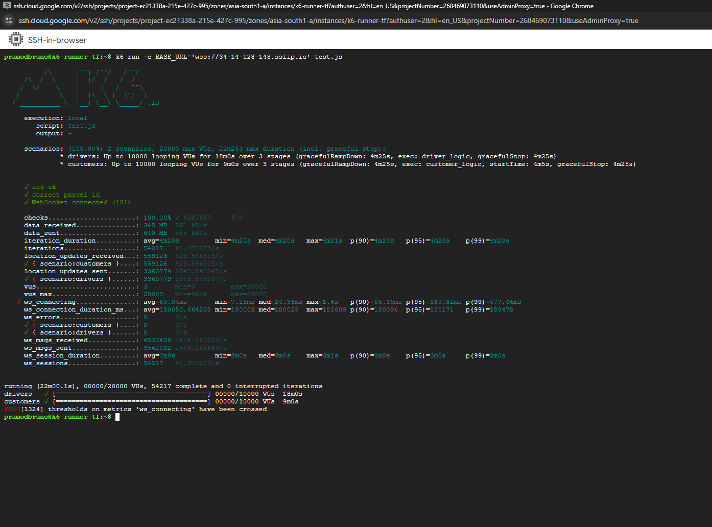
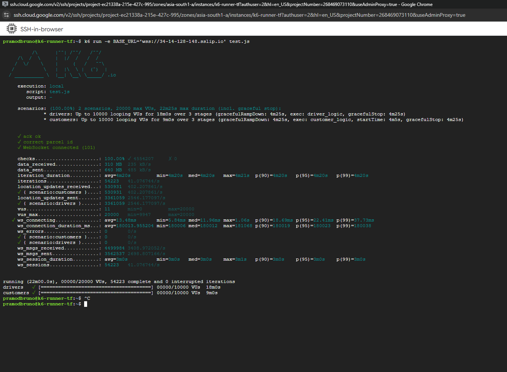

 ## TLS Test (GKE) at 20k VUs 

 It’s not enough to build for it to be useful case.So, I architected with TLS to encrypt the channel.

 For me to use the TLS encryption over the GKE cluster,I performed a total of three
 tests for normal TCP/HTTP from test script from  
 and other two test for TCP/HTTPS from test scripts .As I 
 wanted to to quantify the latency of a backend  and measure the real world simulations for the users.

 - **Normal TCP/HTTP with 20,000 VU**
 - **Normal TCP/HTTPS RSA 2048 TLS with 20,000 VU**
 - **Normal TCP/HTTPS ECDSA TLS with 20,000 VU**

 # Normal TCP/HTTP with 20,000 VU

 

In this test with a TCP/HTTP non-encryption for a total iterations of 52884 in k6 with messages sent  by driver in
average are 2560.47 messages per seconds and customer received 624 messages per second.
With k6 metrics **p(95)=15.62ms**, **p(99)=32.09ms** and **ws_errors=0**

# Normal TCP/HTTPS RSA 2048 TLS with 20,000 VU

In this test with a TCP/HTTPS RSA 2048 TLS Certificate for a total iterations of 54217 
in k6 with messages sent by driver  are 4.5 million and received are 3.5 million
With k6 metrics **p(95)=169.82ms**, **p(99)=477.46ms** and **ws_errors=0**

*Observations*

In this k6 metrics, we can observe our connection spike in p99 near 500ms as RSA 2048
is very CPU intensive and encrypted over the internet. This data proved how using 
HTTPS increases connection duration time but making it secured preventing common Man 
in the middle Attacks.

*Result*

Despite taking higher time for connection, Users data are more secured than in a normal HTTP connection
as they are encrypted making security higher priority.

*Optimization* 
I would implement ECDSA to improve the tailing p99 for connection which is also given below.

# Normal test with 20,000 VU forced eviction of main backend axum-api in the cluster

In this test with a TCP/HTTPS ECDSA TLS Certificate for a total iterations of 54223 
in k6 with messages sent by driver  are 4.5 million and received are 3.5 million
With k6 metrics **p(95)=22.41ms**, **p(99)=37.73ms** and **ws_errors=0**

*Observations*

In this k6 metrics, we can observe our connection spike in p99 was only 37.73ms due to ECDSA
being less CPU intensive operation with same level security and encrypted over the internet. 

*Result*
Despite using encrypted channel for connection, Users data are just as secured as a RSA 2048 TLS connection
but with less CPU intensive leading to less backpressure to NGINX keeping tailing p99 to similar to the Normal TCP/HTTP connection.
