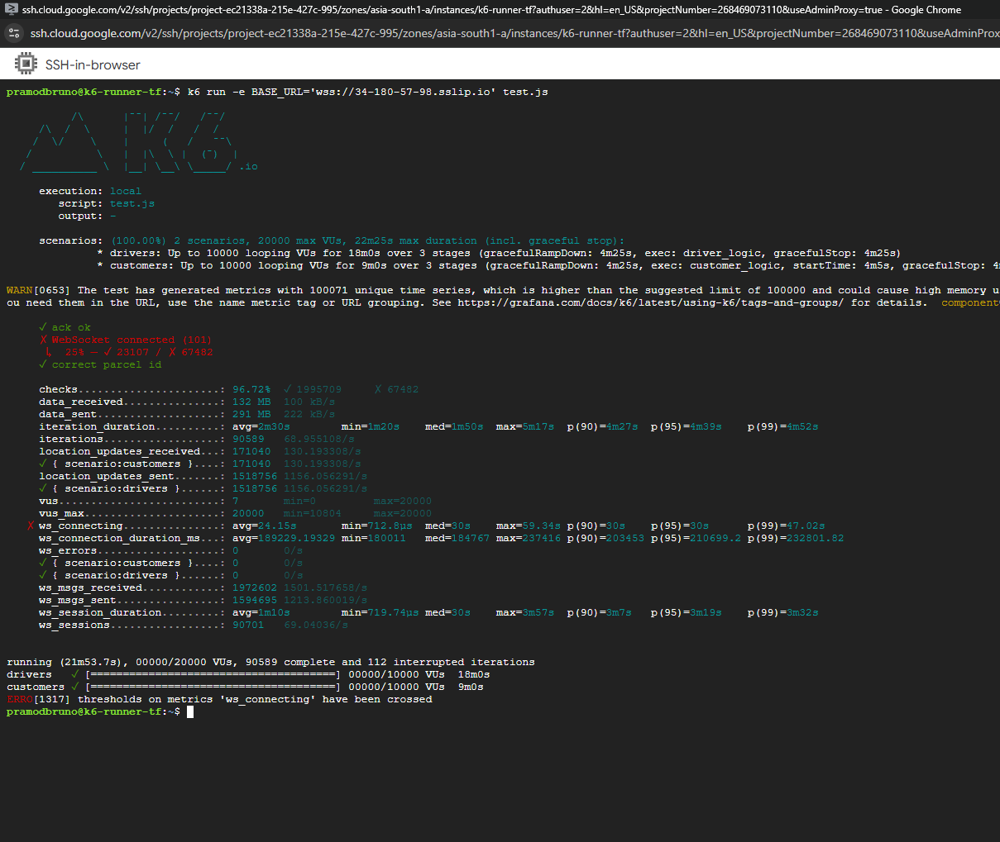
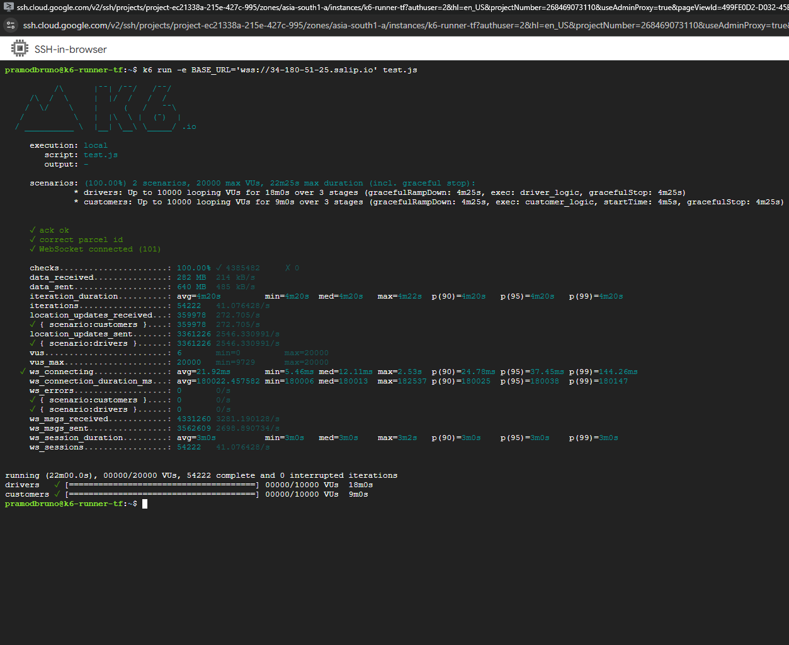

 ## mTLS Test (GKE) at 20k VUs 

 For a Zero trust Architecture, it ensures that connection requires validation at every level.

 For me to use the TLS encryption over the GKE cluster,I performed a total of three
 tests for TCP/HTTPS from test scripts [K6 Test Script](./loadtests/20k_tls_iterations_test.js).As I 
 wanted to quantify the latency of a backend  and measure the real world simulations for the users.

 - **Normal TCP/HTTPS ECDSA P-256 TLS with 20,000 VU**
 - **Normal TCP/HTTPS ECDSA P-256 TLS and ECDSA P-256 mTLS(between each pods) with 20,000 VU but with improper allocation**
 - **Normal TCP/HTTPS ECDSA P-256 TLS and ECDSA P-256 mTLS(between each pods) with 20,000 VU but with proper allocation**

 # Normal TCP/HTTPS ECDSA P-256 TLS with 20,000 VU

 

In this test with a TCP/HTTPS ECDSA P-256 TLS encryption for a total iterations of 52884 in k6 with messages sent  by driver in
average are 2560.47 messages per seconds and customer received 624 messages per second.
With k6 metrics **p(95)=22.41ms**, **p(99)=37.73ms** and **ws_errors=0**.

# Normal TCP/HTTPS ECDSA P-256 TLS and ECDSA P-256 mTLS(between each pods in GKE) with improper allocations of memory with 20,000 VU

During this test due to improper allocation and no allocation of memory and cpu for linkerd proxy in the pods leading to above very high latency of p99=47.05s and with only 25% of websocket suceeded which can be seen above. 

*Observations*

In this k6 metrics, we can observe our connection were only 23107 succeded out of 67482 connection in this can be seen. Higher websocket connection is seen as more  tries were made  to connect after a failure from 53k connection seen prior to this test.

*Result*
From this it can be seen that only by understanding your core api and linkerd proxy usage of memory and cpu for user be at least be pre-examined to ensure resource limits match traffic scale not bottlenecking for the system.So, allocation is important as much as your code in a constrained environment.

*Optimization* 
This can be easily resolved by proper allocation test done below.

# Normal TCP/HTTPS ECDSA P-256 TLS and ECDSA P-256 mTLS(between each pods) with 20,000 VUs but with proper allocation

In this test with a TCP/HTTPS ECDSA TLS Certificate  and a proper linkerd proxy allocation was made of
    cpu:
      request: 250m
      limit: 500m
    memory:
      request: 128Mi
      limit: 500Mi
      

*Observations*

In this k6 metrics, we can observe our connection spike in p99 was only 144ms even after mTLS at each step of our api and 100% success and zero error. 

*Result*
From this we can further reduce our p99 latency by fine tuning both our backends allocation and linkerd proxy allocation.
